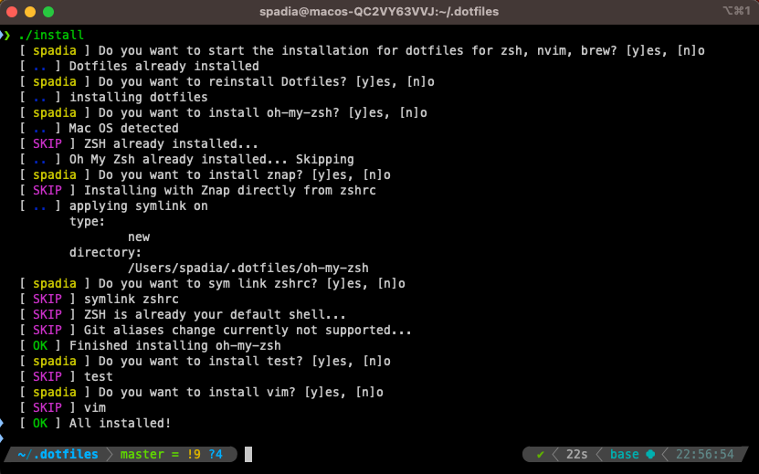

# Dotfiles

This repository contains dotfile configurations for several different terminal based applications
Author: @crizzy9

## Table of Contents

- Installation
- Supported Plugins
  - nvim/vim
  - zsh
  - git
  - homebrew/apt
- TODO:
  - iterm/termintor/tmux
  - btop
  - ripgrep/fzf
  - ranger
  - zathura
  - entr/cron
  - ~~ctags~~
- Custom Keybidings

## Installation

The installation is done via the installation script `install`
This will install all the required plugins and configurations based on user input as shown below



Perform the following steps as per your operating system then install via the script

### MacOs

- Installing **git**
- Install **xcode** by running `$ xcode-select --install`
- Install **homebrew**
- install **unicode fonts**

### Linux

- Install **terminator/kitty** and **tmux**
- Install **unicode fonts**

### Windows

- Install your **favorite terminal**
- TODO

>***Start installation*** with the following commands and follow the prompts
>Note: Refer to plugin instructions for additional customization
>Note: If you dont have experience with symlinks use the test folder to check

```sh
# give execute permissions
chmod +x ./install
# start installer
./install
```

### Supported Plugins

Below is a list of all the plugins supported by this repository, more to come...

### Git

TODO

#### ZSH

After installation run the following to get the latest znap dependencies

```sh
znap pull
```

Remove old `~/.zshrc.zwc` file if changes not taking effect
Also check `echo $ZDOTDIR`
After installation is done
iTerm > Preferences > Profile > Text > Font > Hack Nerd Font

TODO: fix hanging on up arrow key in macos

#### Neovim

You can either setup [Neovim kickstart](https://github.com/nvim-lua/kickstart.nvim) or do a custom setup for nvim

Install neovim plugins
>Note: Make sure you have `ripgrep` and `fzf` installed for telescope to work. Plugins are installed with `mason` and `packer`

##### installing neovim on linux - raspberry pi

```sh
sudo apt install binutils
sudo apt install build-essential
sudo apt install cmake ninja-build
git config --global init.defaultBranch main
mkdir neovym
cd neovym
git clone https://github.com/neovim/neovim.git
cd neovim
mkdir build
mkdir .deps
cd .deps
cmake -G Ninja -DCMAKE_BUILD_TYPE=Release ../cmake.deps/
ninja
which curl
# install rust compilers
curl --proto '=https' --tlsv1.2 -sSf https://sh.rustup.rs | sh
cd ../..
# git clone git@pi-storage.local:/srv/tosh1/git/pi-cargo-bin
source "$HOME/.cargo/env"
 # where to run?
cargo build
cargo install
```

##### kickstart nvim

```sh
nvim # say yes to install plugins
:wq
nvim # should start installing lsp servers now
```

##### custom nvim

```sh
nvim
```

##### minimal vim

```sh
# TODO
```

## Custom Keybindings

Custom keybindings for zsh, nvim and ranger

### terminator shortcuts

```text
Ctrl + Shift + e ( o ) - Vertical pane
Ctrl + Shift + n - cycle through panes
Ctrl + Shift + x - maximize active pane
Ctrl + Shift + f - search in terminal backlog
```

### zsh shortcuts

```text
# TODO: doesnt work in linux
Ctrl + f - fzf open nvim
```

### nvim shortcuts

leader key is mapped to `Space`

```text
# telescope
Space + s + f - telescope file search
Space + s + g - telescope in file grep
# within telescope
Ctrl + p & Ctrl + n - Cycle through suggestions
```
